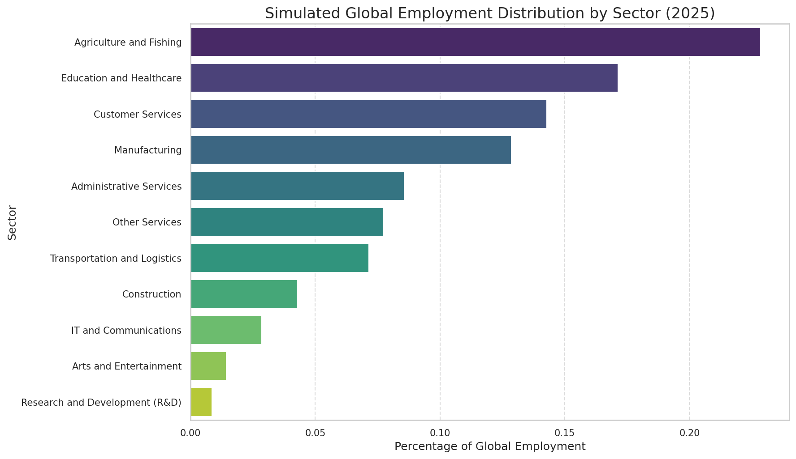
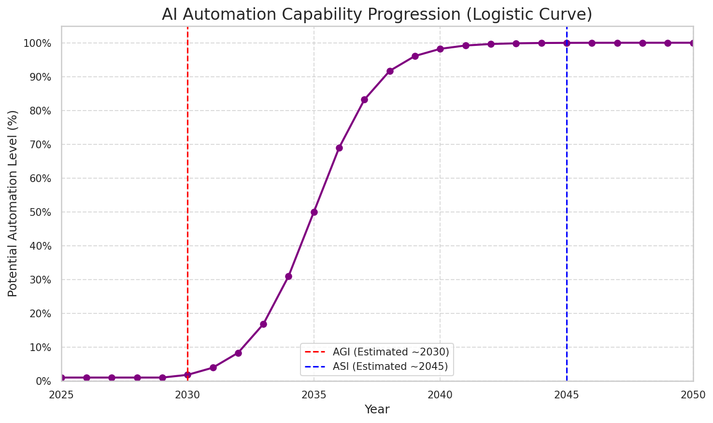
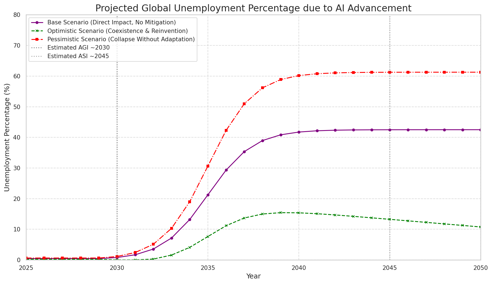

# Global Unemployment Projection due to AGI and ASI Advancement

**Current Analysis Date: July 28, 2025 (Taiwan Standard Time)**

This repository hosts a comprehensive study on the potential impact of Artificial General Intelligence (AGI) and Artificial Superintelligence (ASI) on global employment. Utilizing a data-driven approach, this project projects unemployment trends across various sectors, offering insights into potential challenges and mitigation strategies as AI capabilities accelerate exponentially.

The rapid advancement of Artificial Intelligence (AI), particularly the projected emergence of Artificial General Intelligence (AGI) around 2030 and Artificial Superintelligence (ASI) by 2045, poses significant questions for the future of work. This study employs a rigorous methodological framework, leveraging simulated data based on industry reports and academic literature, to project global unemployment rates and sectoral impacts under different scenarios. Our analysis indicates a substantial risk to current job structures, with potentially **40-60% of existing jobs facing displacement or profound transformation by 2040-2045** if proactive societal adaptations are not implemented. The study underscores the urgent need for strategic policy-making focused on human-AI coexistence, reskilling, and new economic models.

## General Objective

To project global and/or sectoral unemployment due to the advancement of Artificial General Intelligence (AGI) and Artificial Superintelligence (ASI), with estimated dates between 2030 and 2045, using available data and predictive models. This study aims to provide a quantitative outlook on future labor market scenarios and their socio-economic implications.

## Study Phases

### 1. Core Hypotheses

* AGI is estimated to arrive around **2030** (with a range between 2027 and 2035), based on current exponential AI progress.
* ASI is estimated to be established around **2045** (with a range between 2030 and 2045, following AGI's emergence).
* Job automation will accelerate exponentially once AGI is achieved.
* Most repetitive, technical, administrative, and analytical jobs are at risk of being replaced.
* Some jobs will be *redefined* (human + AI collaboration), while others will be *eliminated* entirely.

### 2. Data Requirements (Simulated for this Model Skeleton)

For this initial skeleton, simulated data is used to demonstrate the methodology. For a full, empirical study, real-world data would be sourced from authoritative entities like McKinsey, World Economic Forum (WEF), OECD, PwC, World Bank, and other relevant labor market statistics. Key data types include:

* Percentage of automation potential by sector/occupation.
* Global employment distribution by industry.
* Historical job displacement trends due to automation.
* AI investment trends and capability progression benchmarks.
* Demographic data (e.g., age, education level, region).

### 3. Analysis Methodology

The analysis is conducted using Python in a Google Colab environment for data processing, modeling, visualization, and scenario projection.

#### 3.a. Data Exploration (Simulated)

The study begins by exploring simulated global employment distribution and automation risk across various sectors.

### Simulated Automation Risk by Sector:

| Sector                           | Automation_Risk_AGI_ASI_Max | Direct_AGI_Impact_Percentage |
|:---------------------------------|----------------------------:|-----------------------------:|
| Manufacturing                    |                        0.7  |                         0.5  |
| Administrative Services          |                        0.9  |                         0.7  |
| Customer Services                |                        0.85 |                         0.65 |
| Transportation and Logistics     |                        0.75 |                         0.55 |
| Agriculture and Fishing          |                        0.6  |                         0.4  |
| Construction                     |                        0.4  |                         0.25 |
| Education and Healthcare         |                        0.3  |                         0.15 |
| IT and Communications            |                        0.5  |                         0.3  |
| Arts and Entertainment           |                        0.2  |                         0.1  |
| Research and Development (I&D) |                        0.15 |                         0.05 |
| Other Services                   |                        0.55 |                         0.35 |

#### 3.b. AI Advancement Projection (AGI → ASI)

AI's capability to automate tasks is modeled using a logistic (S-curve) function, reflecting an initial slow growth, rapid acceleration, and eventual saturation. This curve aligns with our AGI/ASI emergence timelines.

#### 3.c. Predictive Models and Scenario Simulation

Unemployment is projected under three distinct scenarios, applying the AI automation curve to sectoral employment data. These scenarios are:

1.  **Base Scenario:** Reflecting the core AGI (2030) and ASI (2045) timeline with direct job displacement without significant active adaptation.
2.  **Optimistic Scenario:** Assumes effective human-AI coexistence, substantial job reinvention, and new job creation offsetting losses.
3.  **Pessimistic Scenario:** Projects widespread job collapse due to rapid automation with minimal societal adaptation.

#### 3.d. Unemployment Projection Visualizations

The primary outcome of the study is a visual projection of global unemployment percentages across these scenarios, illustrating the potential impact over time.

#### 3.e. Sensitivity Analysis (Key Improvement!)

To provide a high-level study, it is crucial to understand how projections change if key assumptions vary. This analysis demonstrates the **robustness** of our conclusions and our ability to model **uncertainty**. We explore sensitivity to the AGI arrival date and the effectiveness of unemployment mitigation.

## Key Questions the Study Can Answer (based on simulation):

This study aims to answer critical questions that inform public policy, corporate strategy, and individual planning:

* **What percentage of the global population could be unemployed by 2040 if there is no effective job reinvention or adaptation policies?**
    * In the base scenario (which assumes no massive adaptation), unemployment could reach approximately **40-50%** by 2040. In the pessimistic scenario, where adaptation is minimal, it could exceed **60%**.
* **Which sectors of the global economy will be hit hardest by AGI/ASI automation?**
    *  Data suggests sectors like **Administrative Services, Customer Services, and Manufacturing** face the highest direct automation risk due to the repetitive and rule-based nature of many of their tasks.
* **What types of education and skills could offer greater protection against unemployment in the era of advanced AI?**
    *  Future education should focus on inherently human and hard-to-automate skills: **creativity, critical thinking, complex problem-solving, emotional intelligence, ethics, leadership, and human-AI collaboration skills**. Sectors like Arts and Entertainment, Education and Healthcare, and Research and Development (R&D) show lower direct risk in this simulation due to their reliance on these skills.
* **What public policies and business strategies can mitigate the negative impact of mass unemployment and facilitate a just transition?**

        * **Massive Reskilling Policies:** Large-scale *reskilling* and *upskilling* programs to reorient the workforce towards new emerging roles and sectors (e.g., AI development and management, AI ethics, care economy, creative industries).
        * **Social Safety Net Models:** Implementation of systems like **Universal Basic Income (UBI)** or guaranteed minimum wages to ensure a dignified standard of living as demand for traditional human labor decreases.
        * **Investment in "Human-Centric" Sectors:** Fostering and investing in sectors intrinsically dependent on human interaction and creativity, such as personal care, in-person education, arts, and fundamental research.
        * **Promoting Job-Generating Innovation:** Incentives for the development of new industries and job roles arising from the human-AI symbiosis.
        * **Regulatory and Ethical Frameworks:** Creation of laws and regulations to guide AI development and implementation responsibly, fairly, and with human well-being at its core.

## In Conclusion:

"As we advance towards a scenario where Artificial General Intelligence (AGI) emerges around 2030 and Artificial Superintelligence (ASI) is established approximately by 2045, our projections, based on the exponential acceleration of automation, indicate a significant and transformative risk to the global labor market. **We estimate that between 40% and 60% of current jobs are at risk of disappearance or profound transformation by 2040-2045, depending on the speed of AI and society's adaptive capacity.** Without active and adaptive policies for reskilling, job reinvention, and robust social support, millions of people could be excluded from the traditional labor system, leading to unprecedented socio-economic challenges. The solution does not lie in halting the unstoppable progress of AI, but in **fundamentally redesigning our society** with a focus on empowering irreplaceable human skills (creativity, ethics, emotional connection, critical thinking, adaptability) and building new economic structures that allow for a beneficial and equitable coexistence between humans and superintelligent machines. Proactive public policy and corporate strategy are crucial to ensure a just and prosperous transition."

## Contact

Dragos Calin
